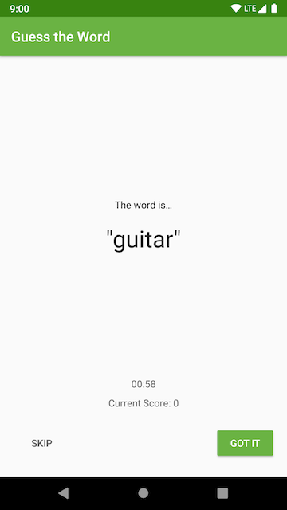

# Application Architecture - The UI Layer - Guess It!
This is the toy app for lesson 5 of the [Udacity: Developing Android Apps with Kotlin course.](https://classroom.udacity.com/courses/ud9012).
- How to use ViewModel 
- How to use LiveData
- Data Binding with viewModel and xml.

## Highlight for lesson 4: 
### Our App Architecture
The software design principle that we're going to be following is called seperation of concerns. This says that our app should be divided into classes, each that have separate responsibilites. 
Architecture gives you guidelines to figure out which classes should have what responisibilites in your app. 
We will be working with three different classes, the UI controller, the ViewModel and LiveData. 


#### ViewModel
ViewModel will do the actual decision making, the purpose of the ViewModel is to hold the specific data needed to display the fragment or activity it's associated with. Also, ViewModel may do simple calculations and transfroamtions on that data so that it's ready to be displayed by the UI controller. The ViewModel class will contain instances of a third class, LiveData. 

#### LiveData
LiveData classes are crucial for communicating information for the ViewModel to the UI controller, that is should update and redraw the screen. 

### Creating a ViewModel 
ViewModel is an abstract class that you will extend and then implement. It holds your apps UI data and survive’s configuration changes. 

Instead of having the UI data at the fragment, move it to your ViewModel and have the fragment reference the ViewModel. The ViewModel survive’s configuration changes so while the fragment is destroyed and then remade, all of the data that you need to display in the fragment, remain in the ViewModel. 

Steps:
1. Add dependency
Open app gradle file and add the dependency: 
```implementation 'androidx.lifecycle:lifecycle-extensions:2.0.0' ```
And since gradle. 
 
2. Create SomethingViewModel class, extending ViewModel:
Create a new file called SomethingViewModel.kt and extend the ViewModel.
```class GameViewModel : ViewModel()```
Note: ViewModel get destroyed when the activity or fragment the view model is associated with is finally and completely destroyed. Right before this happens, there’s a callback called In the ViewModel class called onCleared. 
3. Associated UI controller and ViewModel.

Create and initialized a NameViewModel, using ViewModelProviders. 

Back in SomethingFragment use **_lateinit_** to create a field for SomethingViewModel called ViewModel. Then in onCreateView, request the current SomethingViewModel using the ViewModelProviders class:

``` viewModel = ViewModelProviders.of(this).get(GameViewModel::class.java)```

Note: You never construct ViewModel yourself. If you did, you’d end up constructing a ViewModel every time the fragment was recreated. 


### ViewModel vs UI controller (What kind of data to hold on each)
- UI controller only displays and get user/OS events
- ViewModel holds data for UI
- UI Controller does NOT make decisions
- ViewModel never references fragments and activities or views.

### Benefits of Architecture
1. The code is more organized, manageable and debuggable. 
2. By moving code to the viewModel, you protect yourself from having to worry about lifecycle problem and bugs. 
3. The code is very modular. 
4. The viewModel contains no references to activities, fragments, or views. This happens to be helpful for testing.  

### The power and limits of the ViewModel.

- The first issue is a pre-existing issue that we had before. The ViewModel does preserve data with the configuration changes, but this data is still lost when an app is shut down by the operating system. 
- We need a way to communicate from the ViewModel back to the UI controller without having the ViewModel store references to any views, activities or fragments. We can use **_LiveData_** for this. 

Adding LiveData steps:
1. Add the variable in viewModel and wrap the variable in MutableLiveData. If the variable is Int.
example: 
```val score = MutableLiveData<Int>()```
2. Add the observer to UI component.
example:
```viewModel.score.observe(this, Observer { newScore -> 
binding.scoreText.text = newScore.toString()
})```

### LiveData is LifeCycle Aware

This means that LiveData knows about the lifecycle state of its UI controller observers. LiveData uses this information to interact intelligently with your fragments and activities. 

Things to know:
1. LiveData will only update UI controller that are actually on-screen. If your fragment goes off-screen and the value of LiveData changes, four times, it would not update the off-screen fragment. Only when the UI controller goes from off-screen back to on-screen, LiveData will always trigger the observer with the most recent data. 
2. If the LiveData already exists with some data, and a new UI controller starts to observe it, it’ll get the current data immediately. 
3. Finally, if the UI controller gets destroyed, the LiveData will actually internally clean up its own connection to the observer. 

## Lesson 4: App Architecture
This is the forth android project in [
Guess It is a word guessing app you can play with one or more friends. To play, hold the device in landscape, facing away from you with your thumbs on the **Skip** and **Got It** buttons. Your friends can then give you clues to help you guess the word. 

If you get the word right, press **Got It**. If you're stuck, press **Skip**. The game runs for a minute and then shows you your score.


## Screenshots

  

## How to use this repo while taking the course

Each code repository in this class has a chain of commits that looks like this:


These commits show every step you'll take to create the app. Each commit contains instructions for completing the step.

Each commit also has a **branch** associated with it of the same name as the commit message, as seen below:


Access all branches from this tab.


The branches are also accessible from the drop-down in the "Code" tab.


## Working with the Course Code

Here are the basic steps for working with and completing exercises in the repo.

The basic steps are:

1. Clone the repo.
2. `checkout` the branch corresponding to the step you want to attempt.
3. Find and complete the TODOs.
4. Optionally commit your code changes.
5. Compare your code with the solution.
6. Repeat steps 2-5 until you've gone trough all the steps to complete the toy app.


**Step 1: Clone the repo**

As you go through the course, you'll be instructed to clone the different exercise repositories, so you don't need to set these up now. You can clone a repository from GitHub in a folder of your choice with the command:

```bash
git clone https://github.com/udacity/REPOSITORY_NAME.git
```

**Step 2: Check out the step branch**

As you go through different steps in the code, you'll be told which step you're on, as well as given a link to the corresponding branch.

Check out the branch associated with that step. The command to check out a branch is:

```bash
git checkout BRANCH_NAME
```

**Step 3: Find and complete the TODOs**

Once you've checked out the branch, you'll have the code in the exact state you need. You'll even have TODOs, which are special comments that tell you all the steps you need to complete the exercise. You can navigate to all the TODOs using Android Studio's TODO tool. To open the TODO tool, click the button at the bottom of the screen that says TODO. This will display a list of all comments with TODO in the project. 

We've numbered the TODO steps so you can do them in order:


**Step 4: Commit your code changes**

After you've completed the TODOs, you can optionally commit your changes. This will allow you to see the code you wrote whenever you return to the branch. The following git code will add and save **all** your changes.

```bash
git add .
git commit -m "Your commit message"
```

**Step 5: Compare with the solution**

Most exercises will have a list of steps for you to check off in the classroom. Once you've checked these off, you'll see a pop up window with a link to the solution code. Note the **Diff** link after the Solution link:


The **Diff** link will take you to a GitHub diff as seen below:


All of the code that was added in the solution is in green, and the removed code (which will usually be the TODO comments) is in red. 

You can also diff your local copy of the code with the corresponding branch as you are working on it:

```bash
git diff BRANCH_NAME
```

## Report Issues
Notice any issues with a repository? Please file a GitHub issue in the repository.

